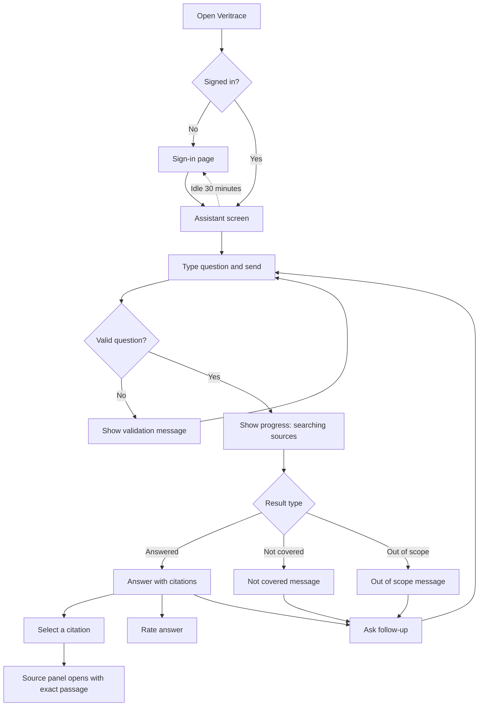
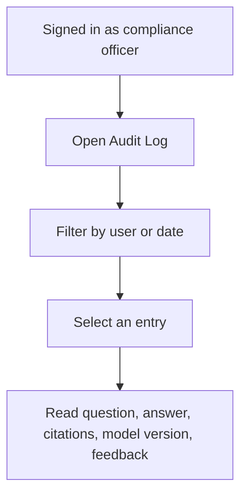

# Veritrace Phase 1 User Flow

| Field | Value |
|---|---|
| Task | UX-1 |
| Owner | UX Designer |
| Status | Approved |
| Started | 2026-09-21 |
| Finished | 2026-09-21 |
| Depends on | BA-2 (User Stories) |
| Hands off to | UX-2 (Wireframes) |

## Main Flow

## Compliance Officer Flow

## Screens

| ID | Screen | Users | Stories |
|---|---|---|---|
| S1 | Sign-in | All | US-07 |
| S2 | Assistant | Investigator, Team Lead | US-01 to US-06, US-09, US-10 |
| S3 | Audit Log | Compliance Officer | US-08 |

## Assistant Screen States

| State | What the user sees | Story |
|---|---|---|
| Empty | Welcome text and three example questions | US-01 |
| Validation error | Message under the input box | US-01 |
| Loading | "Searching sources" progress indicator | US-01 |
| Answered | Answer, numbered citations, as-of dates, feedback buttons | US-02, US-04, US-09 |
| Proposed rule cited | "Proposed rule, not in force" badge on the citation and a note in the answer | US-04 |
| Source open | Source panel with the exact passage | US-03 |
| Not covered | "Not covered by approved sources" message, no citations | US-05 |
| Out of scope | "Not available in this release" message | US-06 |
| Session expired | Redirect to sign-in | US-07 |

## Design Rules

- Every answer shows its citations. No citation, no answer.
- Status is shown with text and color together, never color alone.
- A standing notice reads: "Veritrace answers from approved sources. It is not legal advice."
